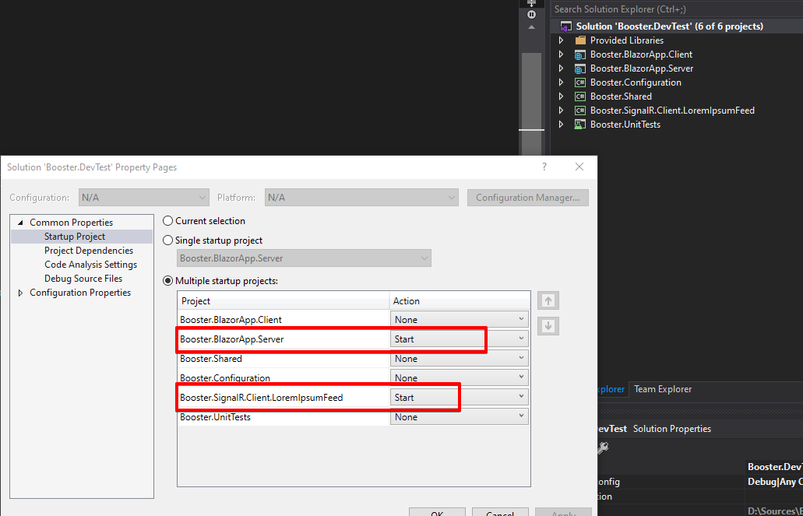
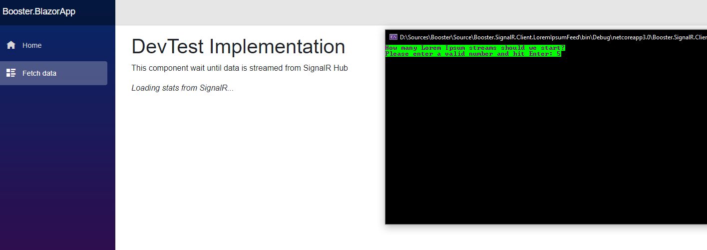
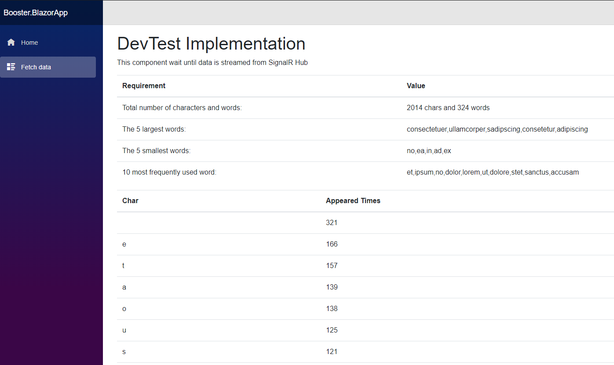

# Booster Development Test

Rules:
1.	Use .Net v4.0+.
2.	Use C#. 
3.	All code and referenced assemblies must be submitted in one zip file.  We need to be able to unzip and run the solution without changing settings, adding references or creating any databases.
4.	Create a suite of unit tests – all tests should be passing.
5.	The code must be submitted on or before the day and time agreed on.

Hint: We are looking at how you approach the problem and the patterns you use to solve them.  We are looking for someone that understands domain modelling, patterns and practices, and is technically proficient. Show us what you know and show us something impressive.

### Question:

Write an application that will continually read text data from the stream provided (DevTest.LorumIpsumStream). 

Then provide in real time (i.e. as you read it from the stream) the following information about the text: 
•	Total number of characters and words 
•	The 5 largest and 5 smallest word 
•	10 most frequently used words
•	List showing all the characters used in the text and the number of times they appear sorted in descending order

## Instructions To Run The App

The code was written in C# (.NET Core 3.0, Blazor) and Visual Studio 2019.  

Please download the repository, open solution in Visual Studio 2019, build, choose Multiple Startup Projects. Application is configured to run server over IIS express on http://localhost:49696/. If that port is changed, please update Booster.SignalR.Client.LoremIpsumFeed appSettings.json. 

Run both at the same time. 
In console app, choose how many lorem ipsum streamers to attach and run the app. Each streamer reads from your DevTest stream, sends data over SignalR. SignalR server calculates the stats and sends to Blazor app. Open Fetch Data tab and see live data from streamers.

